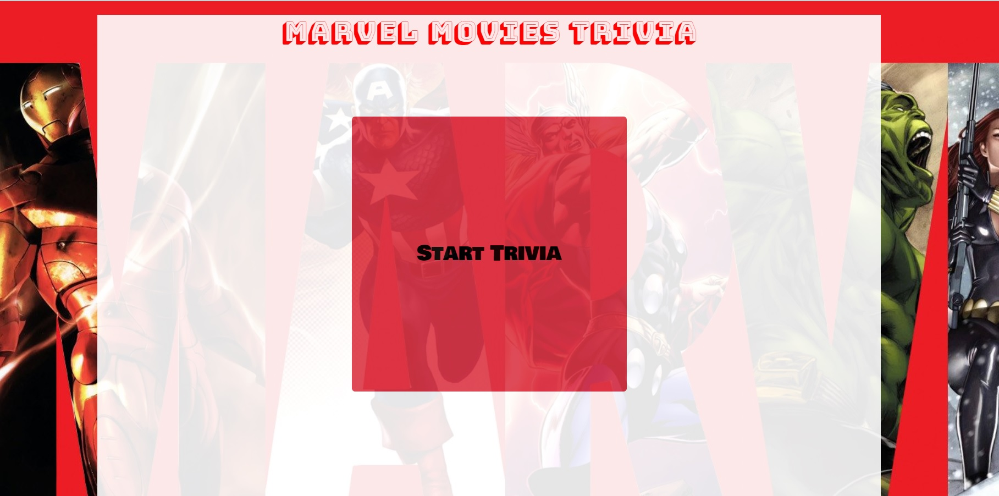
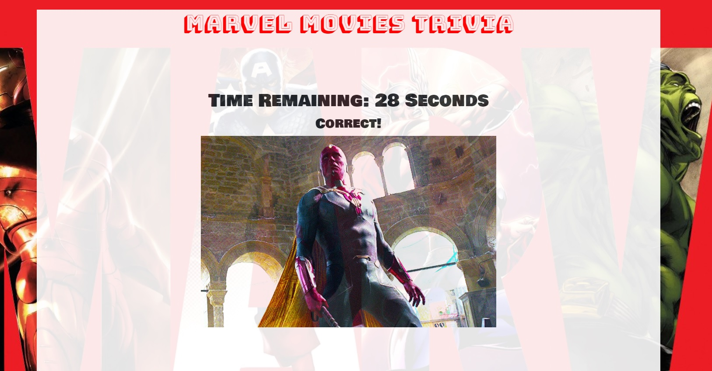
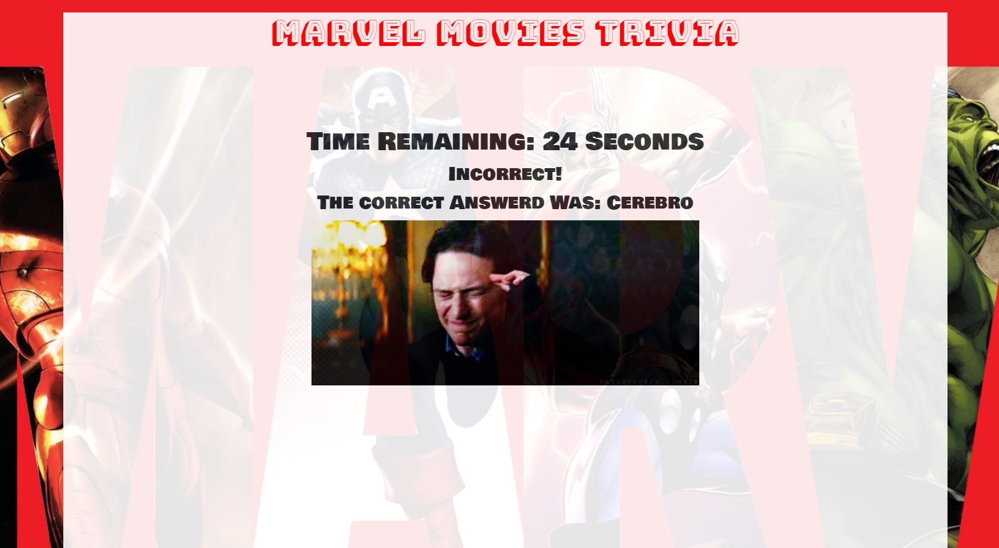
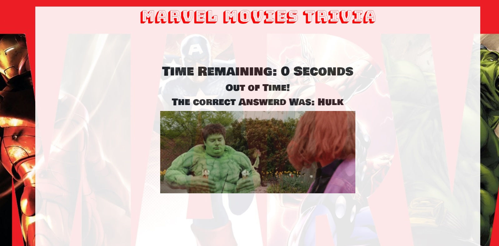
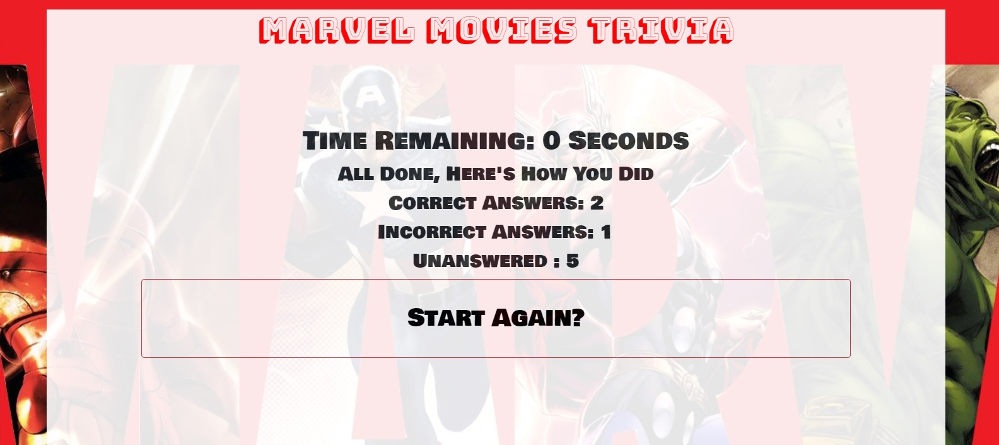

# TRIVIA GAME

## Instructions

### - Shows only one question until the player answers it or their time runs out.

###  - If the player selects the correct answer, show a screen congratulating them for choosing the right option. After a few seconds, display the next question.

### - If the player runs out of time, tell the player that time's up and display the correct answer. Wait a few seconds, then go to the next question.

### - If the player chooses the wrong answer, tell the player they selected the wrong option and then display the correct answer. Wait a few seconds, then go to the next question.

### - On the final screen, show the number of correct answers, incorrect answers, and an option to restart again (don't reload the page).

## Link to the Game  https://kliche1791.github.io/TriviaGame/

## ScreenShot

### Start Game

### Question

### Correct

### Incorrect

### Out Of Time

### Results
